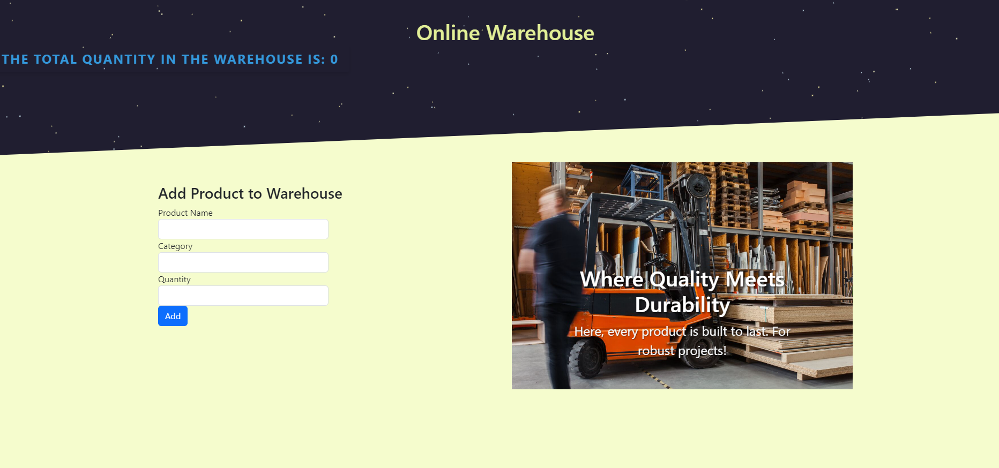

# My Awesome Warehouse 🚀

Welcome to my GitHub repository for Lambru Adrian Georgian's web projects.

## Online Warehouse Demo

Explore the "My Awesome Warehouse" project, a cutting-edge inventory management system crafted with JavaScript, HTML, CSS, and Bootstrap. This application showcases my proficiency in handling JavaScript objects, arrays, functions, and more.

### Features

- **Intuitive Interface:** Seamlessly add, categorize, and manage products.
- **Real-Time Updates:** Monitor and visualize the total quantity in the warehouse instantly.
- **Engaging Carousel:** A dynamic carousel featuring catchy slogans to elevate the user experience.
